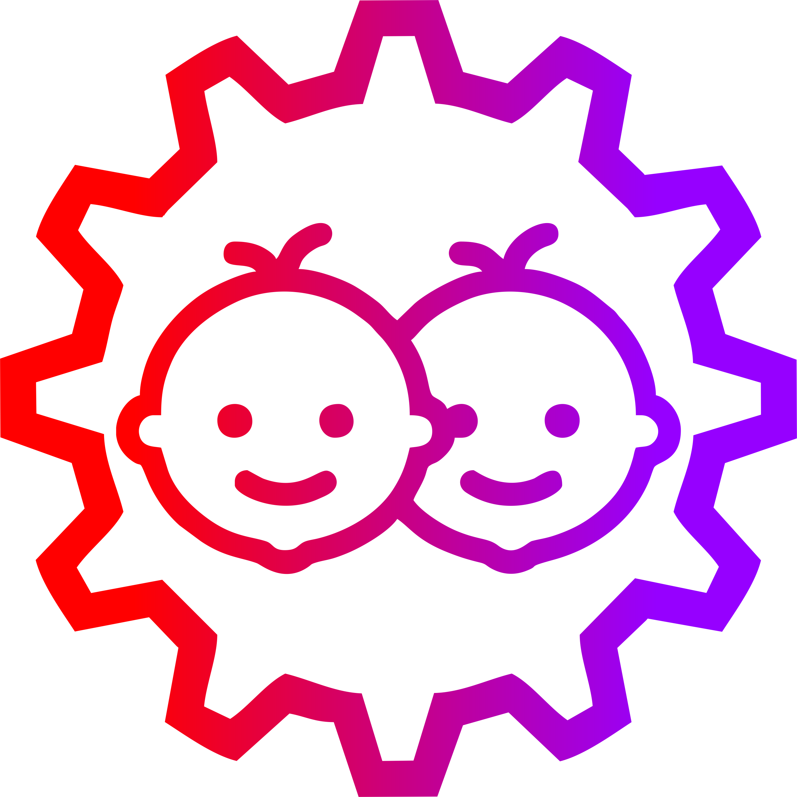
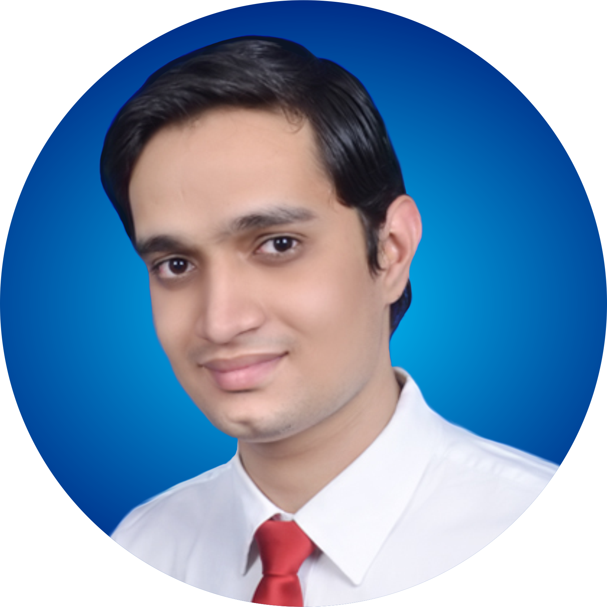

# Scaled Autonomous Vehicles

This repository is a part of course AuE-8360 "Scaled Autonomous Vehicles" at CU-ICAR (Fall 2023).

## Course Description:

**AuE-8360:** Scaled Autonomous Vehicles, as the name suggests, introduces students to various hardware and software aspects of scaled autonomous vehicles. This course adopts a project-based learning approach, where students work on projects within a larger integrative theme of scaled autonomous vehicles. Projects (to be pursued either individually or in 2-3 person teams) will focus on the development and validation of existing cutting-edge approaches to autonomous perception, planning, control and coordination. This course is handled by [Dr. Venkat Krovi](https://www.linkedin.com/in/venkatnkrovi), Michelin Endowed SmartState Chair Professor of Vehicle Automation at [Clemson University International Center for Automotive Research (CU-ICAR)](https://cuicar.com/) and director of [Automation, Robotics and Mechatronics Laboratory (ARMLab)](http://cecas.clemson.edu/armlab-cuicar).

## Group Name:

**Tinker Twins:** [Chinmay Samak](https://www.linkedin.com/in/samakchinmay) and [Tanmay Samak](https://in.linkedin.com/in/samaktanmay) are twin brothers, who use "Tinker Twins" as a personal brand (the team's name was therefore decided to reflect the same brand). The twins have come a long way tinkering with various tools and technologies, which has strengthened their scientific knowledge and skills. The duo has worked on various projects ranging from microelectromechanical systems (MEMS) to in-orbit space settlements, and almost everything in between. They have a particularly keen interest in the field of robotics and autonomous systems, and are specializing in the field of autonomous vehicles.

## Group Members:

**Chinmay Samak:** I received the [B.Tech. degree in Mechatronics Engineering](https://www.srmist.edu.in/program/b-tech-mechatronics-engineering/) with a gold medal from [SRM Institute of Science and Technology](https://www.srmist.edu.in/) in 2021. Having worked on several research projects in the field of autonomous vehicles, complemented with a solid background in mechatronics engineering, I have joined [ARMLab](http://cecas.clemson.edu/armlab-cuicar) at [CU-ICAR](https://cuicar.com/) as a direct Ph.D. candidate under the supervision of [Dr. Venkat Krovi](https://www.linkedin.com/in/venkatnkrovi) to pursue focused research in the field of vehicle automation. My research interests lie at the intersection of formal, data-driven and learning based methods to bridge the sim2real gap using digital twins. I am currently contributing towards projects such as [VIPR-GS](https://cecas.clemson.edu/VIPR-GS/), [OpenCAV](https://sites.google.com/view/opencav/), [AutoDRIVE](https://autodrive-ecosystem.github.io/) and [F1Tenth](https://f1tenth.org/).

**Tanmay Samak:** I received the [B.Tech. degree in Mechatronics Engineering](https://www.srmist.edu.in/program/b-tech-mechatronics-engineering/) with a silver medal from [SRM Institute of Science and Technology](https://www.srmist.edu.in/) in 2021. Having worked on several research projects in the field of autonomous vehicles, complemented with a solid background in mechatronics engineering, I have joined [ARMLab](http://cecas.clemson.edu/armlab-cuicar) at [CU-ICAR](https://cuicar.com/) as a direct Ph.D. candidate under the supervision of [Dr. Venkat Krovi](https://www.linkedin.com/in/venkatnkrovi) to pursue focused research in the field of vehicle automation. My research interests lie at the intersection of real and virtual worlds to create physically and graphically accurate digital twins. I am currently contributing towards projects such as [VIPR-GS](https://cecas.clemson.edu/VIPR-GS/), [OpenCAV](https://sites.google.com/view/opencav/), [AutoDRIVE](https://autodrive-ecosystem.github.io/) and [F1Tenth](https://f1tenth.org/).
